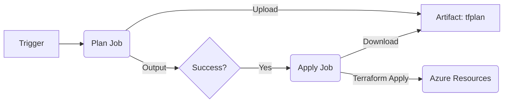

# CI/CD Reference Guide

## Overview

This document defines the Continuous Integration and Continuous Deployment (CI/CD) standards for the Azure Core–Spoke Terraform architecture.

The pipeline strategy implements a Plan-Apply pattern using reusable GitHub Actions workflows. This ensures:

- **Consistency**: Core and Spoke workloads use identical deployment logic.
- **Safety**: Infrastructure changes are validated via terraform plan before being applied.
- **Separation of Concerns**: Infrastructure code (Workload) is strictly separated from environment configuration (Deployment).

For the full architectural context, please refer to reference-architecture.md.

## Workflow Architecture

The CI/CD process consists of three main components:

- **Caller Workflows** (e.g., core-plan-apply.yml): The entry point that orchestrates the deployment for a specific component.
- **Reusable Plan Workflow** (terraform-plan.yml): Validates code, runs security checks, and generates an execution plan.
- **Reusable Apply Workflow** (terraform-apply.yml): Downloads the plan artifact and applies it to Azure.

### The Pipeline Flow



## Directory Structure Alignment

The pipelines rely on the strict directory alignment defined in the Reference Architecture.

| Logic Layer | Path Example | Purpose |
|-------------|-------------|---------|
| Code | Workload/Core/network | Terraform .tf files (Resources) |
| Config | Deployment/Core/network/network.tfvars | Variable values (IPs, Names, SKUs) |
| Pipeline | .github/workflows/core-plan-apply.yml | Maps Code to Config |

## Reusable Workflows

These workflows are centrally managed in .github/workflows/ and must be called by all project pipelines.

### A. Terraform Plan (terraform-plan.yml)

Responsible for initializing Terraform and generating the execution plan.

**Inputs:**

- `working_directory`: Path to the Terraform code (e.g., Workload/Core/network)
- `tfvars_file`: Path to the environment configuration (e.g., Deployment/Core/network/network.tfvars)
- `state_key`: Unique name for the remote backend .tfstate file
- `component_name`: Unique identifier used to name the build artifact

**Key Steps:**

- **Init**: Backend configuration is injected dynamically using secrets and the state_key
- **Plan**: Runs terraform plan using the specific .tfvars file provided in inputs
- **Artifact**: Uploads the tfplan file as a GitHub artifact for the Apply job

### B. Terraform Apply (terraform-apply.yml)

Responsible for executing the pre-approved plan.

**Inputs:**

- `environment`: (e.g., production) Used for GitHub Environment protection rules (manual approvals)
- `working_directory`: Same as the plan step
- `component_name`: Used to find the correct artifact

**Key Steps:**

- **Download**: Retrieves the tfplan artifact generated by the Plan job
- **Apply**: Runs terraform apply tfplan

## How to Create a New Pipeline (Spoke Onboarding)

When onboarding a new Spoke project (e.g., abc-project), you must create a specific pipeline that points to your new spoke directories.

### Step 1: Verify Directory Structure

Ensure your Terraform files exist in the standard paths:

- **Code**: Workload/Spokes/abc-project/network/
- **Config**: Deployment/Spokes/abc-project/network/network.tfvars

### Step 2: Create the Workflow File

Create a new file: .github/workflows/abc-project-plan-apply.yml

### Step 3: Copy & Configure

Use the template below. You only need to change the working_directory, state_key, and tfvars_file paths.

```yaml
name: abc-project-Deploy

on:
  workflow_dispatch:
    inputs:
      component:
        description: "Component to deploy"
        required: true
        type: choice
        options:
          - network
          - compute
          - data
          - ai

permissions:
  id-token: write
  contents: read

jobs:
  plan:
    uses: ./.github/workflows/terraform-plan.yml
    with:
      # 1. Point to the Spoke Workload Directory
      working_directory: Workload/Spokes/abc-project/${{ inputs.component }}

      # 2. Define a unique State Key for this project
      state_key: spokes/abc-project/${{ inputs.component }}.tfstate
      
      # 3. Name the artifact unique to this project
      component_name: abc-project-${{ inputs.component }}
      
      # 4. Point to the Spoke Deployment Configuration
      tfvars_file: Deployment/Spokes/abc-project/${{ inputs.component }}/${{ inputs.component }}.tfvars
    secrets: inherit

  apply:
    needs: plan
    uses: ./.github/workflows/terraform-apply.yml
    with:
      working_directory: Workload/Spokes/abc-project/${{ inputs.component }}
      state_key: spokes/abc-project/${{ inputs.component }}.tfstate
      component_name: abc-project-${{ inputs.component }}
      environment: production
    secrets: inherit
```

## Required Secrets

The pipeline assumes the following secrets are available in the GitHub Repository or Organization:

| Secret Name | Description |
|-------------|-------------|
| AZURE_CLIENT_ID | OIDC Client ID for Azure Authentication |
| AZURE_TENANT_ID | Azure Tenant ID |
| AZURE_SUBSCRIPTION_ID | Target Subscription ID |
| TF_STATE_SA_NAME | Storage Account Name for Terraform State |
| TF_STATE_CONTAINER | Container Name for Terraform State |
| TF_STATE_RG | Resource Group for Terraform State |

## Troubleshooting

- **Path Errors**: If Terraform cannot find variables, verify that tfvars_file input in your caller workflow matches the actual file path in the Deployment directory.
- **Reusability Check**: Ensure terraform-plan.yml uses ${{ inputs.tfvars_file }} in the terraform plan command. If the reusable workflow contains hardcoded paths (e.g., Deployment/Core...), it must be updated to use the dynamic input to support Spokes.
- **State Locking**: If a workflow is cancelled mid-run, the Terraform state may remain locked. You may need to manually unlock it via Azure CLI.
- **OIDC Errors**: Ensure permissions: id-token: write is present in the caller workflow file, as permissions do not always inherit implicitly for OIDC.
